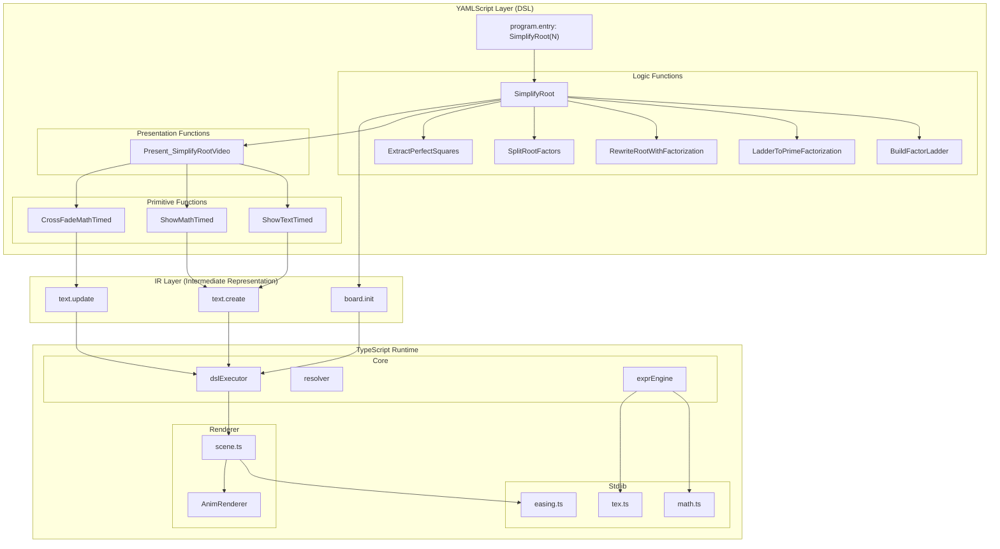

# AnimYAML-DSL Architecture

> **Complete system architecture for the AnimYAML-DSL interpreter**  
> A declarative animation DSL that compiles YAML specifications into timeline events rendered as educational math animations.

---

## Table of Contents

1. [System Overview](#system-overview)
2. [Layer Diagram](#layer-diagram)
3. [YAMLScript Layer (DSL Functions)](#yamlscript-layer-dsl-functions)
4. [TypeScript Runtime Layers](#typescript-runtime-layers)
5. [Data Flow](#data-flow)
6. [IR API Reference](#ir-api-reference)
7. [Expression Engine](#expression-engine)

---

## System Overview

```
┌─────────────────────────────────────────────────────────────────────────────┐
│                           AnimYAML-DSL System                                │
├─────────────────────────────────────────────────────────────────────────────┤
│                                                                             │
│   YAML Spec (example.yaml)                                                  │
│         │                                                                   │
│         ▼                                                                   │
│   ┌─────────────┐    ┌──────────────┐    ┌─────────────┐                   │
│   │ yamlLoader  │───▶│schemaValidator│───▶│ dslExecutor │                   │
│   └─────────────┘    └──────────────┘    └──────┬──────┘                   │
│                                                  │                          │
│                      ┌───────────────────────────┼───────────────────────┐  │
│                      │                           ▼                       │  │
│                      │  ┌──────────┐    ┌────────────┐    ┌───────────┐ │  │
│                      │  │ resolver │◄──▶│ exprEngine │◄──▶│  stdlib   │ │  │
│                      │  └──────────┘    └────────────┘    └───────────┘ │  │
│                      │                           │                       │  │
│                      │                           ▼                       │  │
│                      │                  ┌────────────────┐               │  │
│                      │                  │ TimelineEvent[]│               │  │
│                      │                  └───────┬────────┘               │  │
│                      └──────────────────────────┼────────────────────────┘  │
│                                                 │                           │
│                                                 ▼                           │
│                      ┌──────────────────────────────────────────────────┐   │
│                      │              Renderer Layer                       │   │
│                      │  ┌─────────┐    ┌──────────────┐                 │   │
│                      │  │ scene   │───▶│ AnimRenderer │───▶ Canvas      │   │
│                      │  └─────────┘    └──────────────┘                 │   │
│                      └──────────────────────────────────────────────────┘   │
│                                                                             │
└─────────────────────────────────────────────────────────────────────────────┘
```

---

## Layer Diagram



---

## YAMLScript Layer (DSL Functions)

These functions are defined in the `defs:` section of the YAML spec and executed by the DSL interpreter.

### Entry Point

| Function | Params | Returns | Description |
|----------|--------|---------|-------------|
| **SimplifyRoot** | `N` | `FinalLatex` | Main entry point. Orchestrates the entire root simplification animation |

### Logic Functions (Computation Layer)

Pure computation functions that transform data without side effects.

| Function | Params | Returns | Description |
|----------|--------|---------|-------------|
| **BuildFactorLadder** | `N` | `Ladder` | Computes prime factors and quotient chain for division ladder visualization |
| **LadderToPrimeFactorization** | `N`, `Ladder` | `PFLatex` | Converts ladder data to prime factorization LaTeX (e.g., `720 = 2^4 × 3^2 × 5`) |
| **RewriteRootWithFactorization** | `N`, `PF` | `RWLatex` | Creates root rewrite form (e.g., `√720 = √(2^4 × 3^2 × 5)`) |
| **SplitRootFactors** | `N`, `RW`, `Ladder` | `SRLatex` | Splits root into product of roots (e.g., `√720 = √2^4 × √3^2 × √5`) |
| **ExtractPerfectSquares** | `N`, `Ladder`, `SR` | `FinalLatex` | Extracts perfect squares for final form (e.g., `√720 = 12√5`) |

### Presentation Functions (Animation Layer)

Functions that orchestrate the visual presentation timeline.

| Function | Params | Returns | Description |
|----------|--------|---------|-------------|
| **Present_SimplifyRootVideo** | `N`, `Ladder`, `PF`, `RW`, `SR`, `FinalLatex` | — | Choreographs the full animation: title → prompt → ladder → transformations |

### Primitive Functions (IR Wrappers)

Low-level functions that emit IR events to the timeline.

| Function | Params | Returns | Description |
|----------|--------|---------|-------------|
| **ShowTextTimed** | `id`, `text`, `at`, `style`, `t0`, `t1`, `ease` | — | Emits `text.create` IR with `mode: "text"` |
| **ShowMathTimed** | `id`, `latex`, `at`, `style`, `t0`, `t1`, `ease` | — | Emits `text.create` IR with `mode: "math"` (KaTeX) |
| **CrossFadeMathTimed** | `id`, `toLatex`, `at`, `style`, `t0`, `t1`, `ease`, `transition` | — | Emits `text.update` IR with crossFade transition |

### YAMLScript Call Graph

```
SimplifyRoot(N)
├── board.init(viewbox, theme)                    # IR
├── BuildFactorLadder(N) → Ladder
│   ├── math.prime_factors(N)                     # stdlib
│   └── math.quotient_chain(N, factors)           # stdlib
├── LadderToPrimeFactorization(N, Ladder) → PF
│   ├── math.count_powers(factors)                # stdlib
│   └── tex.prime_factor_expr(N, powers)          # stdlib
├── RewriteRootWithFactorization(N, PF) → RW
│   ├── tex.rhs_of_equation(PF)                   # stdlib
│   └── tex.root_rewrite(N, rhs)                  # stdlib
├── SplitRootFactors(N, RW, Ladder) → SR
│   ├── math.count_powers(factors)                # stdlib
│   └── tex.split_root(N, powers)                 # stdlib
├── ExtractPerfectSquares(N, Ladder, SR) → FinalLatex
│   ├── math.count_powers(factors)                # stdlib
│   └── tex.extract_squares(N, powers)            # stdlib
└── Present_SimplifyRootVideo(N, Ladder, PF, RW, SR, FinalLatex)
    ├── ShowTextTimed("title", ...)               # → text.create
    ├── ShowMathTimed("prompt", ...)              # → text.create
    ├── ShowTextTimed("L0", ...)                  # → text.create
    ├── foreach i in range(0, len(factors)):
    │   ├── ShowTextTimed("R{i}", factor)         # → text.create
    │   └── ShowTextTimed("L{i+1}", quotient)     # → text.create
    ├── ShowMathTimed("factline", PF)             # → text.create
    ├── CrossFadeMathTimed("factline", RW)        # → text.update
    ├── CrossFadeMathTimed("factline", SR)        # → text.update
    └── CrossFadeMathTimed("factline", Final)     # → text.update
```

---

## TypeScript Runtime Layers

### Layer 1 — Core (`src/core/`)

The interpreter engine that parses, validates, and executes YAMLScript.

| File | Function | Description |
|------|----------|-------------|
| **types.ts** | — | Type definitions: `YAMLSpec`, `TimelineEvent`, `Statement`, `FunctionDef`, etc. |
| **yamlLoader.ts** | `loadYAML(yaml: string)` | Parse raw YAML string → `YAMLSpec` object |
| **schemaValidator.ts** | `validateSchema(spec)` | Validate required sections, version, dialect; returns `{valid, errors, warnings}` |
| **resolver.ts** | `resolve(value, env, spec)` | Resolve `$.path` refs (from spec root) and `$Var.field` (from environment) |
| | `deepResolve(value, env, spec)` | Recursively resolve all values in an object tree |
| **exprEngine.ts** | `evaluate(expr, args, env)` | Evaluate expression string with stdlib function calls |
| | `isExpression(value)` | Type guard: check if value is `{expr, args}` object |
| **dslExecutor.ts** | `execute(spec)` | Entry point: run program, produce `TimelineEvent[]` |
| | `executeFunction(fn, args, ...)` | Run a `FunctionDef` body in scoped environment |
| | `executeStatement(stmt, ...)` | Dispatch: call / let / foreach / return / ir |
| | `executeCall(call, ...)` | Call user-defined function or IR primitive |
| | `executeLet(letStmt, ...)` | Bind variable in environment |
| | `executeForeach(foreach, ...)` | Loop over array with scoped variable |
| | `executeIR(ir, ...)` | Emit `board.*` / `text.*` event to timeline |
| **timeline.ts** | `normalizeTimeline(events)` | Sort events, index by element ID, compute duration |
| | `validateTimeline(events)` | Check unique IDs, required fields |
| | `snapshotTimeline(events)` | Deterministic JSON for testing/diffing |

### Layer 2 — Stdlib (`src/stdlib/`)

Pure utility functions callable from YAMLScript expressions.

| File | Function | Description |
|------|----------|-------------|
| **math.ts** | `primeFactors(n)` | `720 → [2,2,2,2,3,3,5]` — prime factors with multiplicity |
| | `quotientChain(n, factors)` | `720, [2,2,2,2,3,3,5] → [720,360,180,90,45,15,5,1]` |
| | `countPowers(factors)` | `[2,2,2,2,3,3,5] → [{p:2,k:4}, {p:3,k:2}, {p:5,k:1}]` |
| **tex.ts** | `primeFactorExpr(n, powers)` | `"720 = 2^4 × 3^2 × 5"` |
| | `rhsOfEquation(pf)` | Extract RHS after `=` sign |
| | `rootRewrite(n, rhs)` | `"\\sqrt{720} = \\sqrt{2^4 × 3^2 × 5}"` |
| | `splitRoot(n, powers)` | `"\\sqrt{720} = \\sqrt{2^4} × \\sqrt{3^2} × \\sqrt{5}"` |
| | `extractSquares(n, powers)` | `"\\sqrt{720} = 12\\sqrt{5}"` — simplified form |
| **easing.ts** | `linear(t)` | Linear interpolation |
| | `easeOutCubic(t)` | Cubic ease-out curve |
| | `easeInCubic(t)` | Cubic ease-in curve |
| | `easeInOutCubic(t)` | Cubic ease-in-out curve |
| | `easeOutQuad(t)` / `easeInQuad(t)` | Quadratic easing |
| | `getEasingFunction(name)` | Lookup by string name |
| | `calculateProgress(t, t0, t1, ease)` | Compute eased progress `[0,1]` at time `t` |

### Layer 3 — Renderer (`src/renderer/`)

Converts timeline events to visual scene state.

| File | Function / Export | Description |
|------|-------------------|-------------|
| **scene.ts** | `computeScene(events, t)` | Given events + time → `Scene` snapshot with elements |
| | `processTextCreate(scene, event, t)` | Handle `text.create` event at time `t` |
| | `processTextUpdate(scene, event, t)` | Handle `text.update` with crossFade transition |
| | `renderMath(latex)` | KaTeX → HTML string |
| | `boardToPixel(x, y, viewbox, w, h)` | Convert board coordinates → pixel coordinates |
| **AnimRenderer.tsx** | `AnimRenderer` | React component: renders `Scene` to canvas with KaTeX elements |

### Layer 4 — UI (`src/ui/`)

React application shell and user interface components.

| File | Component | Description |
|------|-----------|-------------|
| **App.tsx** | `App` | Root layout, tab navigation, YAML↔Anim state management, 2-way selection binding |
| **CodePanel.tsx** | `CodePanel` | YAML editor with line numbers, clickable lines, ScrollArea |
| **AnimPanelWithControls.tsx** | `AnimPanelWithControls` | AnimRenderer + PlayerControls wrapper |
| **AnimPanel.tsx** | `AnimPanel` | Simple panel wrapper |
| **PlayerControls.tsx** | `PlayerControls` | Play/pause button, time scrubber, duration display |
| **TimelineDebugPanel.tsx** | `TimelineDebugPanel` | Raw timeline event inspector |
| **ChatPanel.tsx** | `ChatPanel` | LLM chat interface for DSL Q&A |

---

## Data Flow

```
┌──────────────────┐
│   example.yaml   │
│   (YAMLSpec)     │
└────────┬─────────┘
         │ loadYAML()
         ▼
┌──────────────────┐
│  Parsed Spec     │
│  {params, defs,  │
│   program, ...}  │
└────────┬─────────┘
         │ validateSchema()
         ▼
┌──────────────────┐
│  Validated Spec  │
└────────┬─────────┘
         │ execute()
         │
         │  ┌─────────────────────────────────────────┐
         │  │         DSL Execution Loop              │
         │  │                                         │
         │  │  1. executeFunction(SimplifyRoot)       │
         │  │  2. executeCall(BuildFactorLadder)      │
         │  │     └── evaluate("math.prime_factors")  │
         │  │  3. executeCall(LadderToPrimeFactorization) │
         │  │     └── evaluate("tex.prime_factor_expr")   │
         │  │  4. ... more calls ...                  │
         │  │  5. executeCall(Present_SimplifyRootVideo)  │
         │  │     └── foreach i in range():           │
         │  │         └── executeIR(text.create)      │
         │  │             └── timeline.push(event)    │
         │  └─────────────────────────────────────────┘
         │
         ▼
┌──────────────────┐
│ TimelineEvent[]  │
│ [{type, args,    │
│   timestamp}, ...│
└────────┬─────────┘
         │
         │  ┌─────────────────────────────────────────┐
         │  │         Render Loop (60fps)             │
         │  │                                         │
         │  │  for each frame at time t:              │
         │  │    scene = computeScene(events, t)      │
         │  │    for each element in scene:           │
         │  │      render(element, opacity, position) │
         │  └─────────────────────────────────────────┘
         │
         ▼
┌──────────────────┐
│   Canvas/DOM     │
│   Animation      │
└──────────────────┘
```

---

## IR API Reference

Intermediate Representation events that the DSL emits to the timeline.

### Board Events

| IR Function | Args | Description |
|-------------|------|-------------|
| `board.init` | `viewbox: [xMin, yMax, xMax, yMin]`, `theme: {bg}` | Initialize board dimensions and background |

### Text Events

| IR Function | Args | Description |
|-------------|------|-------------|
| `text.create` | `id`, `text`, `mode`, `at`, `style`, `t0`, `t1`, `ease` | Create text element with fade-in animation |
| `text.update` | `id`, `toText`, `mode`, `at`, `style`, `t0`, `t1`, `ease`, `transition` | Update existing text (crossFade supported) |

### Future IR (Defined but not yet implemented)

| IR Function | Description |
|-------------|-------------|
| `point.create` | Create a point on the board |
| `line.create` | Create a line segment |
| `polygon.create` | Create a polygon shape |
| `numberline.create` | Create a number line |
| `numberline.movePoint` | Animate point along number line |
| `graph.plot` | Plot a function graph |
| `graph.movePoint` | Animate point on graph |
| `graph.tangentAt` | Show tangent line at point |
| `balance.create` | Create balance scale visualization |
| `balance.setLeftRight` | Set balance weights |
| `flow.create` | Create flow diagram |
| `flow.setStep` | Highlight flow step |
| `bar.create` | Create bar/segment diagram |
| `bar.mergeSegments` | Animate segment merge |
| `bar.scaleTo` | Scale bar to new value |
| `slider.create` | Create interactive slider |
| `param.set` | Dynamically set a parameter |
| `effect.flash` | Flash effect on element |
| `effect.confetti` | Confetti celebration effect |

---

## Expression Engine

The expression engine evaluates function calls within `{expr, args}` objects.

### Built-in Functions

| Function | Signature | Description |
|----------|-----------|-------------|
| `index` | `index(array, i)` | Get element at index |
| `len` | `len(array)` | Array length |
| `add` | `add(a, b)` | Addition |
| `mul` | `mul(a, b)` | Multiplication |
| `format` | `format(template, ...values)` | Printf-style formatting |
| `concat` | `concat(...strings)` | String concatenation |
| `range` | `range(start, end)` | Generate integer range `[start, end)` |
| `map` | `map(array)` | (Passthrough for now) |
| `reduce` | `reduce(array, fn, init)` | (Returns init for now) |

### Stdlib Functions (via expression engine)

| Function | Description |
|----------|-------------|
| `math.prime_factors(N)` | Prime factorization |
| `math.quotient_chain(N, factors)` | Division ladder chain |
| `math.count_powers(factors)` | Group factors by prime |
| `tex.prime_factor_expr(N, powers)` | LaTeX prime factorization |
| `tex.rhs_of_equation(pf)` | Extract RHS of equation |
| `tex.root_rewrite(N, rhs)` | Root rewrite LaTeX |
| `tex.split_root(N, powers)` | Split root LaTeX |
| `tex.extract_squares(N, powers)` | Simplified root LaTeX |

### Variable Resolution

- `$.path.to.value` — Resolves from YAML spec root (e.g., `$.params.time.title.t0`)
- `$VarName` — Resolves from local environment
- `$Var.field` — Resolves variable then accesses nested field

---

## File Structure

```
src/
├── core/                    # DSL Interpreter
│   ├── types.ts            # Type definitions
│   ├── yamlLoader.ts       # YAML parsing
│   ├── schemaValidator.ts  # Spec validation
│   ├── resolver.ts         # Variable resolution
│   ├── exprEngine.ts       # Expression evaluation
│   ├── dslExecutor.ts      # Statement execution
│   └── timeline.ts         # Timeline utilities
│
├── stdlib/                  # Standard Library
│   ├── math.ts             # Math functions
│   ├── tex.ts              # LaTeX generation
│   └── easing.ts           # Animation easing
│
├── renderer/                # Visual Renderer
│   ├── scene.ts            # Scene computation
│   └── AnimRenderer.tsx    # React canvas component
│
├── ui/                      # User Interface
│   ├── App.tsx             # Main application
│   ├── CodePanel.tsx       # YAML editor
│   ├── AnimPanelWithControls.tsx
│   ├── AnimPanel.tsx
│   ├── PlayerControls.tsx
│   ├── TimelineDebugPanel.tsx
│   └── ChatPanel.tsx
│
├── fixtures/
│   └── example.yaml        # Example YAMLScript
│
└── components/ui/           # shadcn/ui components
```

---

## Summary

The AnimYAML-DSL system is structured in distinct layers:

1. **YAMLScript Layer** — Declarative DSL functions (`SimplifyRoot`, `BuildFactorLadder`, etc.) that define animation logic
2. **IR Layer** — Intermediate representation events (`text.create`, `text.update`) that bridge DSL and renderer
3. **Core Layer** — TypeScript interpreter that parses, validates, and executes YAMLScript
4. **Stdlib Layer** — Pure utility functions for math and LaTeX generation
5. **Renderer Layer** — Converts timeline events to visual scene state at any time `t`
6. **UI Layer** — React application with YAML editor, animation preview, and playback controls

This architecture enables:
- **Deterministic animations** — Same YAML always produces same output
- **Separation of concerns** — Logic, presentation, and rendering are cleanly separated
- **Extensibility** — New IR primitives and stdlib functions can be added independently
- **Two-way binding** — Click YAML to highlight elements, click elements to highlight YAML
